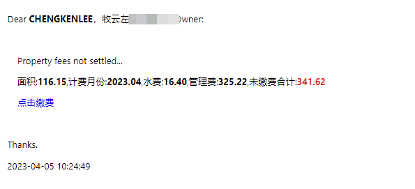

# 好邻邦助手

## Support

```
好邻邦助手查询物业管理费

Usage: okbang [-c conf] [-h]

Options:
  -c string
    	conf file (default "/app/sbin/.okbang.yaml")
  -h	show help information

2023-04-05T10:16:37.999+0800    info    okbang/login.go:99      自动登陆成功
2023-04-05T10:16:38.185+0800    info    okbang/login.go:157     家:牧云左岸1幢xxx,面积:116.15,计费月份:2023.04,水费:16.40,管理费:325.22,未缴费合计:341.62
2023-04-05T10:16:40.317+0800    info    okbang/send.go:28       14xxxx3@qq.com send successed.
2023-04-05T10:16:43.803+0800    info    okbang/send.go:28       chengkenlee@sina.com send successed.
2023-04-05T10:16:43.803+0800    info    okbang/login.go:227     邮件发送完成

```


## Author

* **Author**  - **_ChengKen_**
* **Mail**    - **_chengkenlee@sina.com_**

  ###### **The wind blows away the thoughts, rolled up unruly time**


## Best Regards

* Hat tip to anyone whose code was used
* Inspiration
* etc
